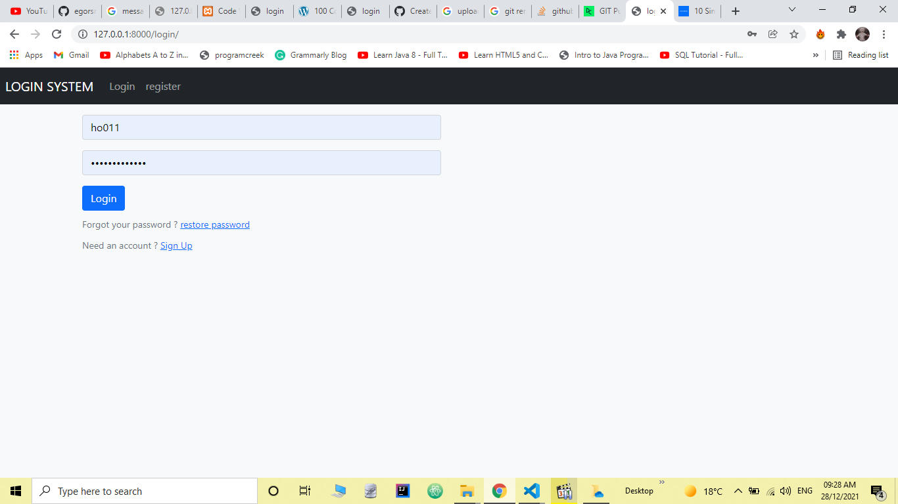
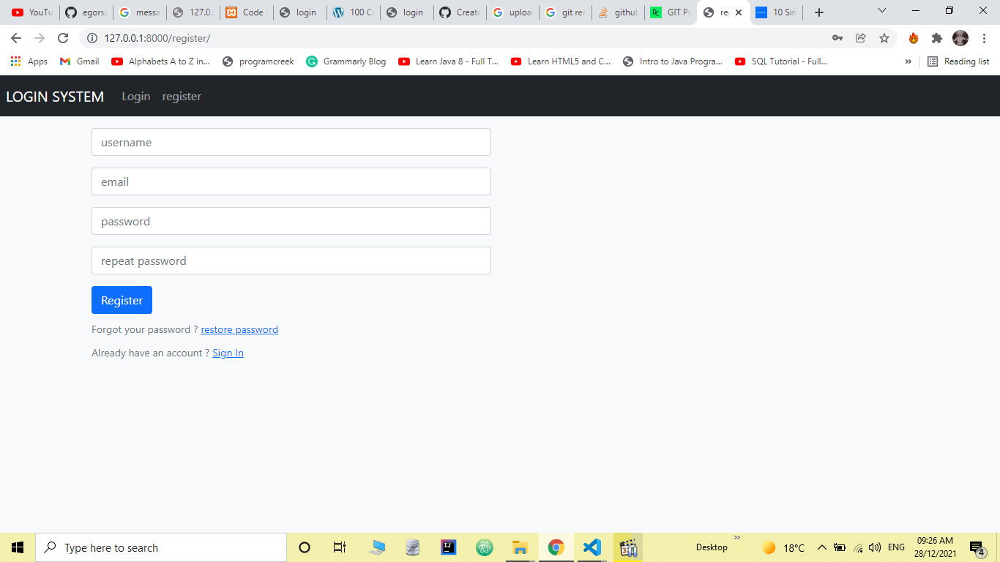
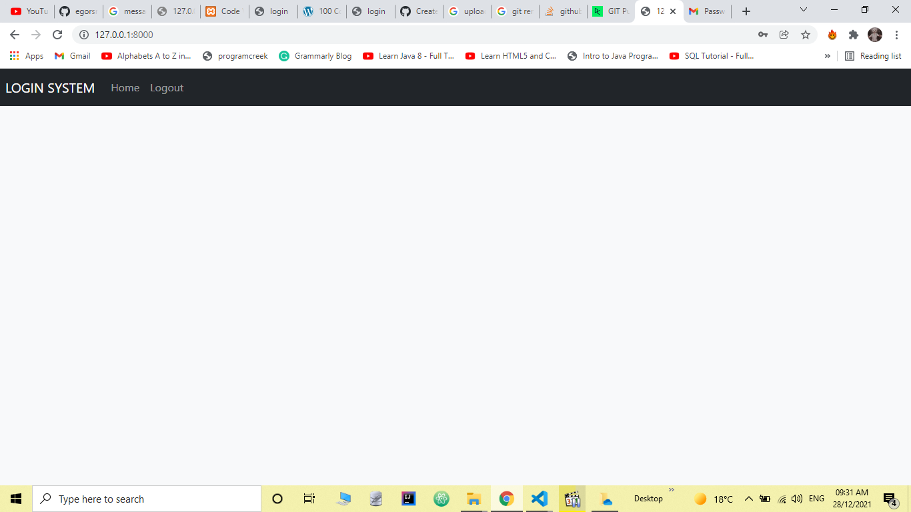
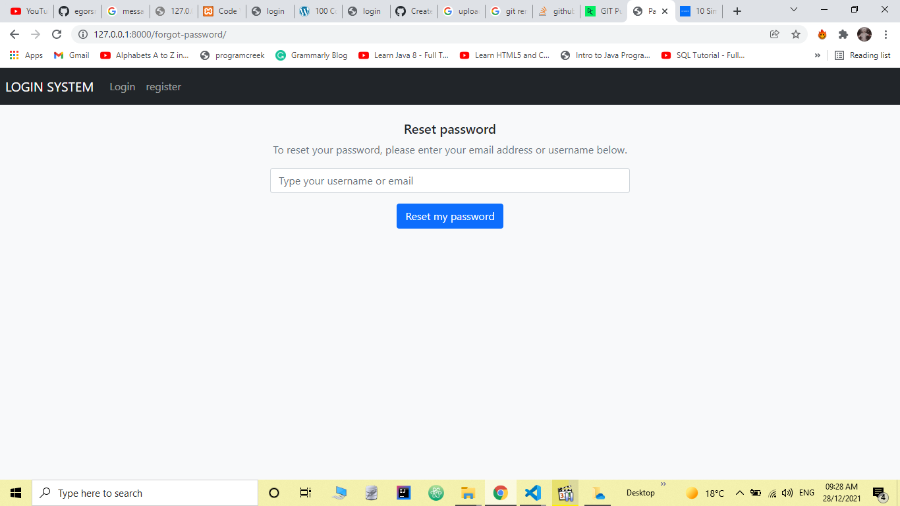
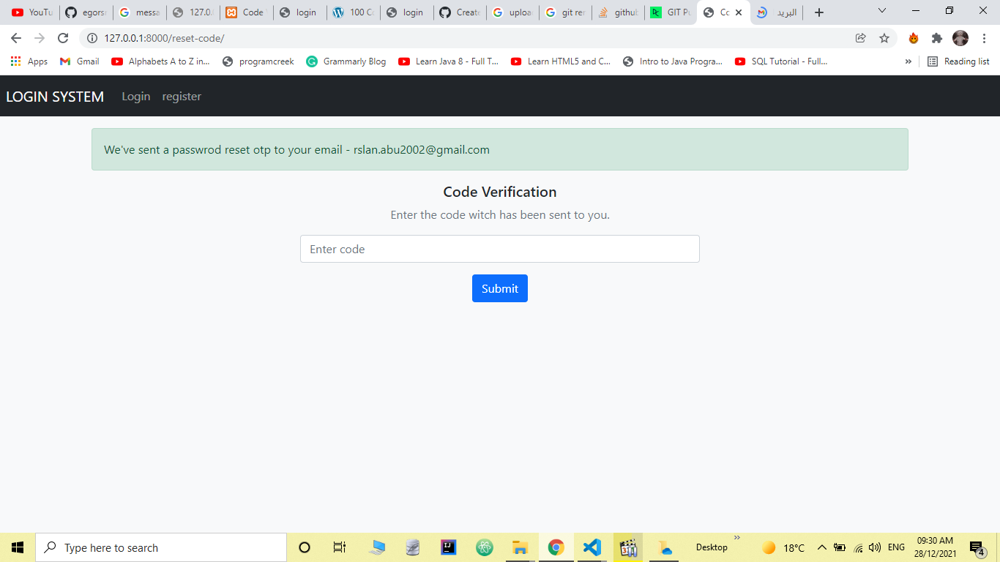
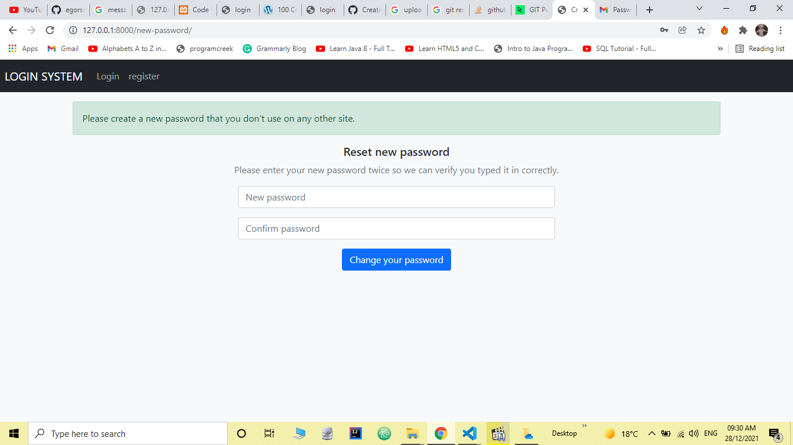

# Simple Django Login and Registration

An example of Django project with basic user functionality.

## Screenshots

| Log In | Create an account | Authorized page |
| -------|--------------|-----------------|
|  |  |  |

| Password reset | verifying page | Password change |
| ---------------|------------------|-----------------|
|  |  |  |

## Functionality

- Log in
  - via username & password
  - via email & password
  - via email or username & password
- Create an account
- Log out
- Profile activation via email
- Reset password

## Installing

### Clone the project

```git
git clone https://github.com/Ho011/django-login-and-register.git
```

### Install dependencies & activate venv

unix / mac

``` python
python3 -m pip install --user virtualenv
```

windows

```python
py -m pip install --user virtualenv
```

create a virtual environment

unix / mac

```pyhton
python3 -m venv env
```

windows

```pyhton
py -m venv env
```


And tell pip to install all of the packages in this file using the -r flag:

unix / mac

``` python
python3 -m pip install -r requirements.txt
```

windows

```python
py -m pip install -r requirements.txt
```

### Configure the settings (connection to the database, connection to an SMTP server, and other)

1. Edit `core/settings.py` if you want to develop the project.

2. Create .env file in `core/` and add your environment variable
   1. El archivo .env tiene que contener lo siguiente:
      ```python
            SECRET_KEY=prueba
            EMAIL_HOST=smtp.gmail.com
            SERVER_EMAIL=server_mail@gmail.com
            EMAIL_HOST_USER=host_mail@gmail.com
            EMAIL_HOST_PASSWORD=host_mail_password
  
            DEFAULT_FROM_EMAIL=prueba@gmail.com
            EMAIL_BACKEND=django.core.mail.backends.smtp.EmailBackend
      ```

3. Apply migrations

#### A development server

Just run this command:

``` python
python manage.py runserver
```

## Ejecución con docker:
- Se ha seguido este tutorial: https://docs.docker.com.zh.xy2401.com/v17.09/compose/django/#create-a-django-project
- Create Dockerfile:
    ```dockerfile
     FROM python:3
     ENV PYTHONUNBUFFERED 1
     RUN mkdir /code
     WORKDIR /code
     ADD requirements.txt /code/
     RUN pip install -r requirements.txt
     ADD . /code/
    ```
- Create requirements.txt
    ```text
     Django>=1.8,<2.0
     psycopg2
    ```
- Create a file called docker-compose.yml in your project directory
    ```yaml
    services:
      db:
        image: postgres
        volumes:
          - ./data/db:/var/lib/postgresql/data
        environment:
          - POSTGRES_DB=postgres
          - POSTGRES_USER=postgres
          - POSTGRES_PASSWORD=postgres
      web:
        build: .
        command: python manage.py runserver 0.0.0.0:8000
        volumes:
          - .:/code
        ports:
          - "8000:8000"
        environment:
          - POSTGRES_NAME=postgres
          - POSTGRES_USER=postgres
          - POSTGRES_PASSWORD=postgres
          - SECRET_KEY=prueba
          - EMAIL_HOST=smtp.gmail.com
          - SERVER_EMAIL=server_mail@gmail.com
          - EMAIL_HOST_USER=host_mail@gmail.com
          - EMAIL_HOST_PASSWORD=host_mail_password
          - DEFAULT_FROM_EMAIL=prueba@gmail.com
          - EMAIL_BACKEND=django.core.mail.backends.smtp.EmailBackend
        depends_on:
          - db
    ```
- It is necessary to create a Django project to execute de yaml
- in settings.py, modify ALLOWED_HOSTS:
    ```python
    ALLOWED_HOSTS = ['127.0.0.1']
    ```
- enviroment variables when working in terminal:
    ```text
    export SECRET_KEY=prueba
    export EMAIL_HOST=smtp.gmail.com
    export SERVER_EMAIL=server_mail@gmail.com
    export EMAIL_HOST_USER=host_mail@gmail.com
    export EMAIL_HOST_PASSWORD=host_mail_password
    export DEFAULT_FROM_EMAIL=prueba@gmail.com
    export EMAIL_BACKEND=django.core.mail.backends.smtp.EmailBackend
    ```
- Execute: `docker-compose up`